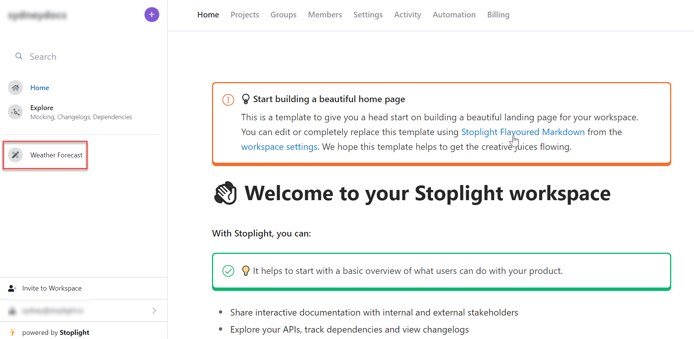
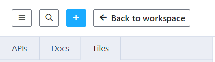
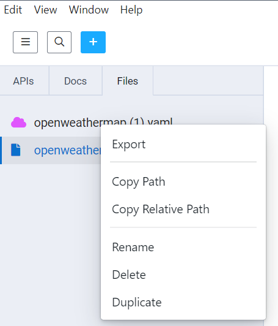

# Export from Stoplight

To retrieve a project or file published in Stoplight, export or download within Studio Web, Studio Desktop, or Explorer.

## Export Projects
> This option includes API descriptions and markdown files.

### Download Projects with Studio Web

1. Log in to your workspace, then select the project you want to download in **Edit** mode.

2. From the menu, select **Download Project Zip**.

> Downloading projects resolves $refs in OpenAPI and JSON Schema files. Design library users can view references to models in the design library.

### Download Projects with Studio Desktop

1. Select the project you want to download.
2. From the menu, select **Open project folder**.

3. In the dialog, select **Open** to navigate to the folder.

4. Create a zip file of the folder contents.

> Downloading projects resolves $refs in OpenAPI and JSON Schema files. Design library users can view references to models in the design library.

## Export Files
> This option is only available for API descriptions.

### Export Files with Studio Web

1. Log into your workspace, then select the project you want to export.

2. Select **Export**. From the menu, select either **Original** or **Bundled References**. The **Original** option is the raw file keeping the $refs. The **Bundled** option resolves all $refs by inserting each resolved reference inline.

**To export a single file in Studio Web:**

1. Log into your workspace, then select **Files** from the top left menu.

2. Right-click on the file you want to export.

3. Select **Export** and **Save File**.

### Export Files with Explorer

1. Log into your workspace, then select **Explore** on the left pane.

2. Select the project you want to export.

3. Within the **Docs** page, select **Export**. From the menu, select either **Original** or **Bundled References**. The **Original** option is the raw file keeping the $refs. The **Bundled** option resolves all $refs by inserting each resolved reference inline.

### Export Single Files with Studio Desktop

1. Select the project with the file you want to export.
2. Select **Files** on the top left pane.
3. Right-click on the file you want to export, then select **Export**.

