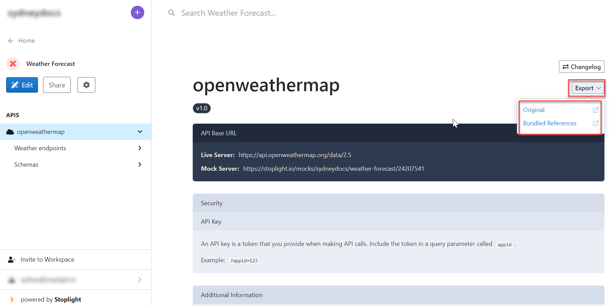
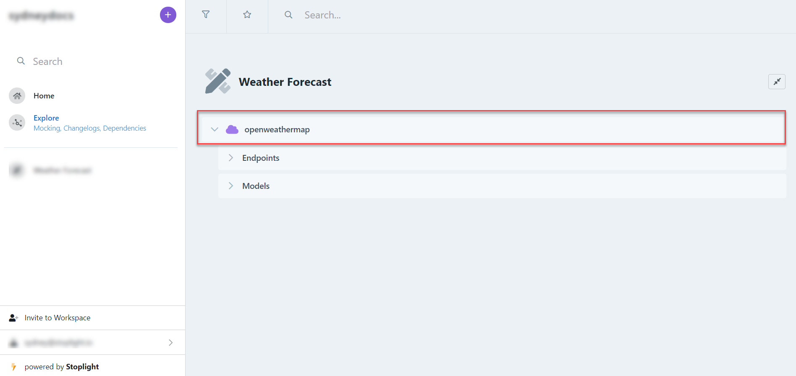
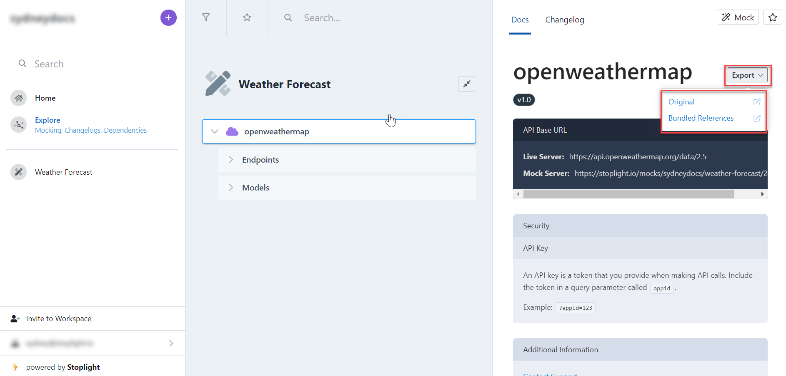
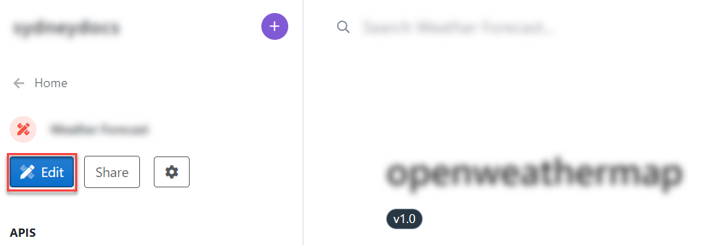
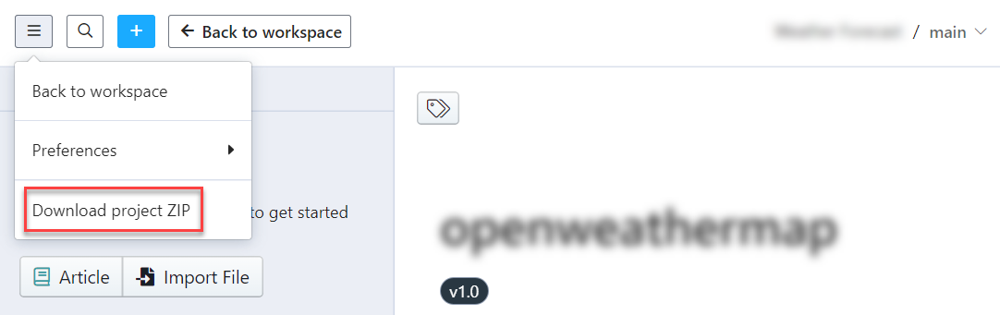
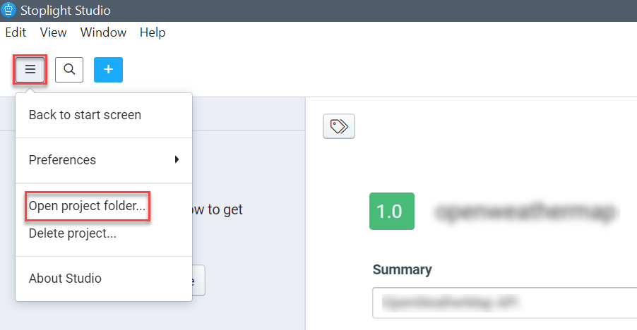
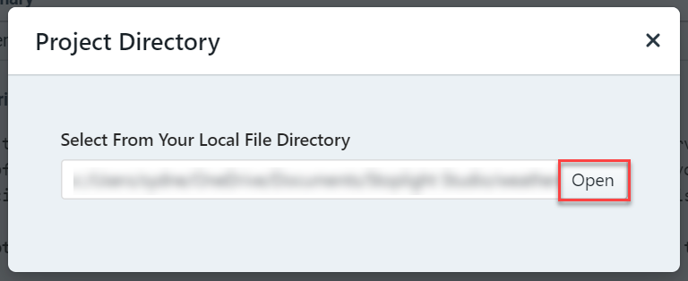
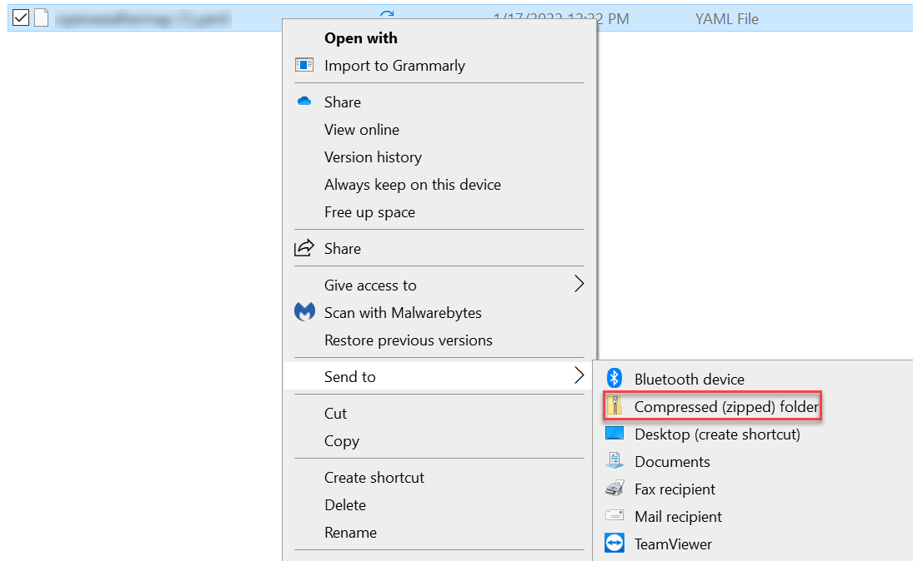
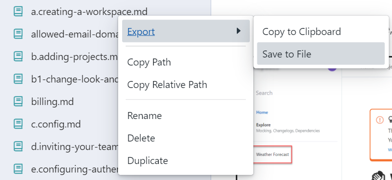

# Export from Stoplight

Stoplight enables you to export:

* Individual OpenAPI specifications in a project, including models included in the specification.
* Individual models.
* An entire project, including all OpenAPI specifications, models, and Markdown articles. 
* Any individual file added to a project.

## Export API Documents

API documents are exported from the published documentation view or from Explorer. This enables your API consumers to obtain API specifications on their own.

### $ref Options

There are two options for exporting references:

* **Original**: $refs are are exported but not resolved.
* **Bundled References**. All $refs are resolved and an placed in the components section so there is no duplication.

The following images shows an example of both options. An export with the original option is on the left; bundled references are shown on the right.

### Export APIs with Studio Web

1. Log in to your workspace, and then select the project you want to export.

2. Select:
   * The API overview (shown in the following example) to export all endpoints and models.
   * A single model.

3. Select **Export**, and then select a [reference option](#$ref-options).

### Export APIs with Explorer

1. Log in to your workspace, and then select **Explore** on the left pane.

2. Find the project you want to export.

3. Within the project, the API overview (shown in the following example or a single model.
4. Select **Export**, and then select a [reference option](#$ref-options).

## Export a Project
This option exports all API descriptions and markdown files into a zip file.

Downloading projects resolves $refs in OpenAPI and JSON Schema files. Design library users can view references to models in the design library.

### Download Projects with Studio Web

1. Log in to your workspace, then select the project you want to download in **Edit** mode.

2. From the menu, select **Download Project Zip**.

### Download Projects with Studio Desktop

1. Select the project you want to download.
2. From the menu, select **Open project folder**.

3. In the dialog, select **Open** to navigate to the folder.

4. Use a local zip tool to create a zip file of the folder contents.

## Export Single Files

Use this option to export individual files in your project. The steps apply to Studio Web and Studio Desktop.

> Spectral files cannot be exported.

1. Log in to your workspace, and then edit a project.
2. Select the **Files** tab.
3. Right-click on the file you want to export.
4. Select **Export**>**Save File**.

