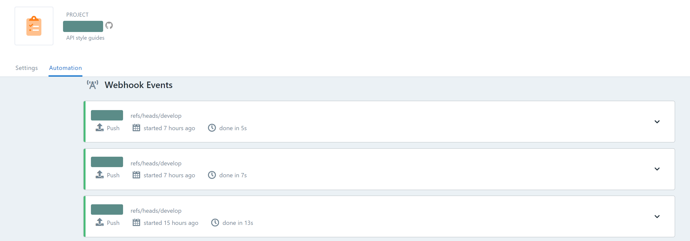
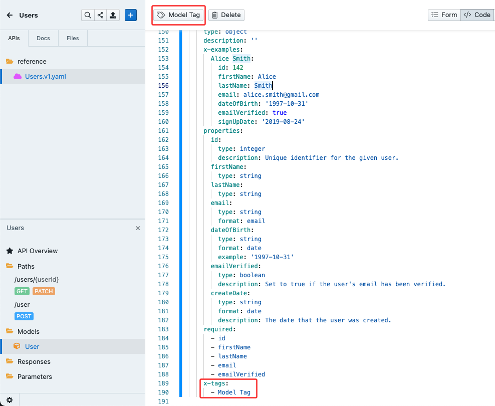

# FAQ

Below you will find answers to commonly encountered questions.

<!-- markdown-link-check-disable-next-line -->
> If you are having trouble and can't find a suitable answer, don't hesitate to [reach out to support](https://support.stoplight.io).

## Try It and Mocking

### Why is "Try It" returning network errors?

Try these solutions:

1. Verify that your computer is connected to the internet.
2. Make sure the API is running and available under the specified URL.
3. If you've checked all of the above and are still experiencing issues, check if the API supports [CORS](https://developer.mozilla.org/en-US/docs/Web/HTTP/CORS). Requests from browsers will be blocked for APIs that don't have appropriate CORS headers set up for `*.stoplight.io.` 

<!-- markdown-link-check-disable-next-line -->
See the [Knowledge Base](https://stoplighthelp.force.com/s/article/Error-while-making-the-request-Network-Error-the-API-did-not-return-a-response) for guidance on resolving this error.

### Why do I get 422 Unprocessable Entity Responses?

Stoplight uses the Fetch Standard to make Mock Server and Try-It requests from the browser. As a result, Studio Web returns a 422 Unprocessable Entity response when a GET is paired with a request body. This occurs because the request body isn’t transmitted by Fetch and therefore the request fails validation against the specification.

## Why are files missing from my project documentation?

Below are a few common reasons why APIs/models/articles may not show up in the documentation for a Stoplight project.

### Is there a Stoplight Config file present in your repo?

Use the **Stoplight Config** (`.stoplight.json`) file to include or exclude paths in your repository from being exposed in the documentation. Verify the project configuration to make sure the file you are looking for hasn't been excluded (or the file is in the include path).

For more information on this feature, see [Project Configuration](./2.-workspaces/c.config.md).

### Is there a `toc.json` file present in your repo?

The `toc.json` file can be used to restrict what's published in the documentation view for a project. This is useful for controlling the presentation of the sidebar.

If you have a `toc.json` file present in your project, verify the contents to make sure the files you want to publish are listed. 

For more information on this feature, see [here](4.-documentation/Sidebar/d.table-of-contents.md).

### Is the branch you are on published in the project settings?

Verify that the branch you are pushing your updates to is published and listed. The published and available branches can be found under the project **Settings** page.

For more information on how to manage, expose, and re-label branches, see [Branch Management](2.-workspaces/h.branch-management.md).

### If all else fails, check the Automation tab

If your project is connected to a Git repository, use the **Automation** tab on the project **Settings** page which should provide more information on what events were received and if they were successfully published.

When reviewing the **Automation** tab, verify that recent pushes to the repository are listed. If not, it may point to an issue with the webhook configuration. Try re-installing the webhook to resolve.

Errors will be highlighted in red. Pending tasks are highlighted in purple. 

## Why is there an "Others" section in the sidebar?

If you're seeing an "Others" section in the sidebar of your project documentation:

Grouping of operations is completed by the use of [tags](https://swagger.io/docs/specification/grouping-operations-with-tags/). To prevent an "Others" section from being generated, be sure to add at least one tag to each endpoint and model in your project.

<!-- theme: warning -->

> When adding a tag to a model, an [OpenAPI Extension](https://swagger.io/docs/specification/openapi-extensions/) must be used. This can be added using the <i class="fal fa-tags"></i> icon in the editor to apply a tag or manually within code view.

You can find more information on the default order of the project sidebar (as well as how to customize it) [here](https://meta.stoplight.io/docs/platform/4.-documentation/d.table-of-contents.md).

## What are the differences between Original, Bundled, and Dereferenced?

1. Original - is the raw file keeping the $refs
2. Bundled - resolves remote $refs once, re-referencing the same objects in subsequent references (producing a smaller file)
3. Dereferenced - resolves all $refs, inserting each resolved reference inline

## Does Stoplight support adding HTML to documentation?

HTML support within Markdown is limited. See the [Using Markdown in Documentation](4.-documentation/markdown-basics.md) page for more information.

## What browsers does Stoplight support?

Stoplight aims to support the following browsers and minimum versions: 

|               | Chrome | Safari        | Firefox | Edge          |
| ------------- | ------ | ------------- | ------- | ------------- |
| Documentation | 90     | 14            | 91      | 95            |
| Platform      | 90     | 14            | 91      | 95 |
| Studio        | 90     | Not Supported | 91      | Not Supported |

Things may work outside of these browsers and these versions, but there might be unexpected problems as they won't have been tested.

## What languages are supported?

Today Stoplight is only available in the English language. While it's possible to host your own content in Stoplight that's not English, you may experience minor errors and other discrepancies when using non-Latin letters or scripts. For example, only the Latin alphabet is supported in Stoplight's search functionality.
