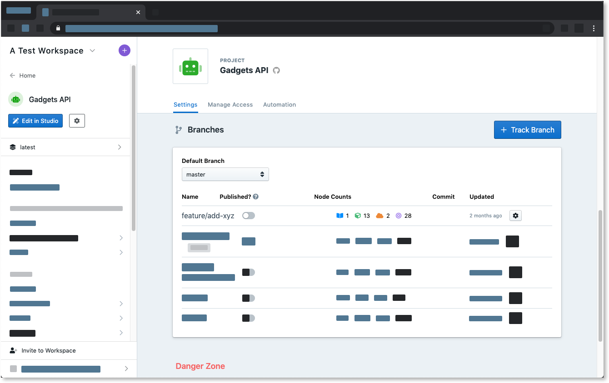
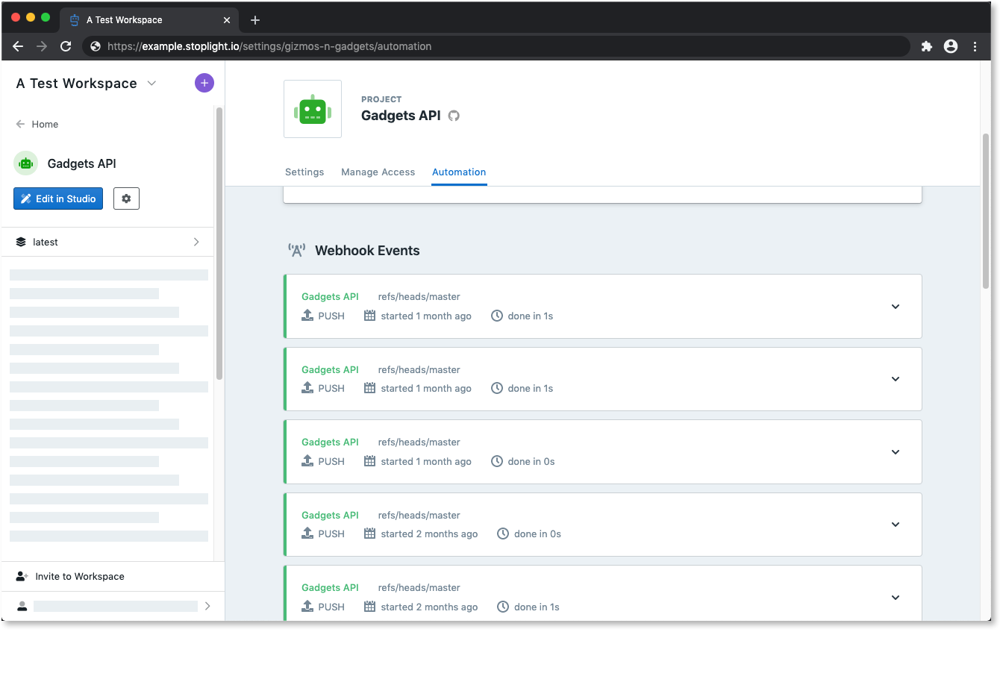
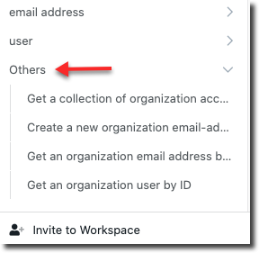
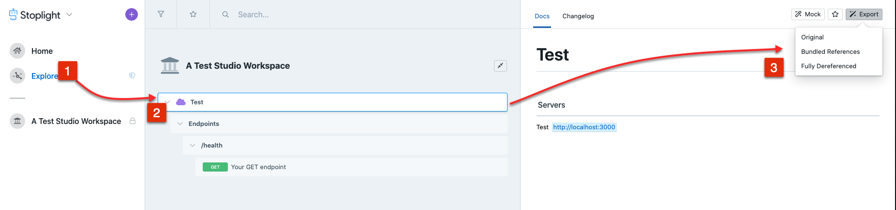
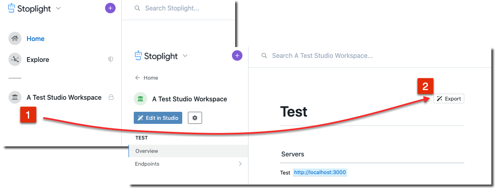
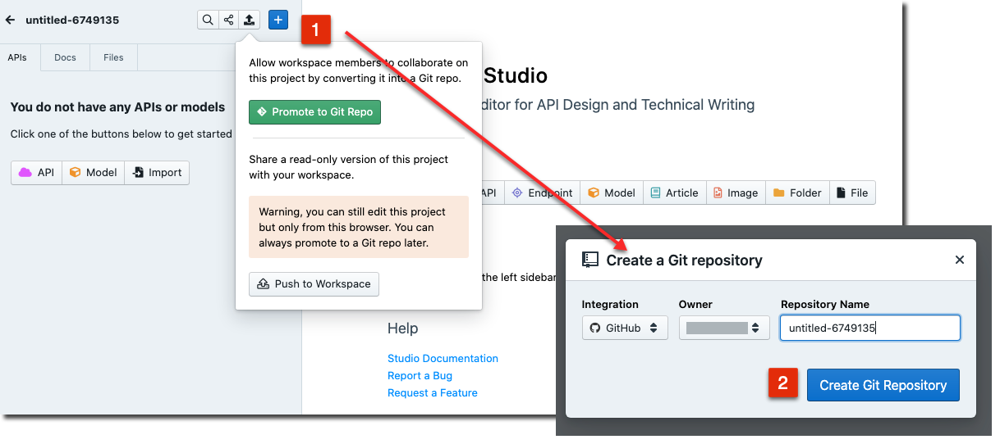
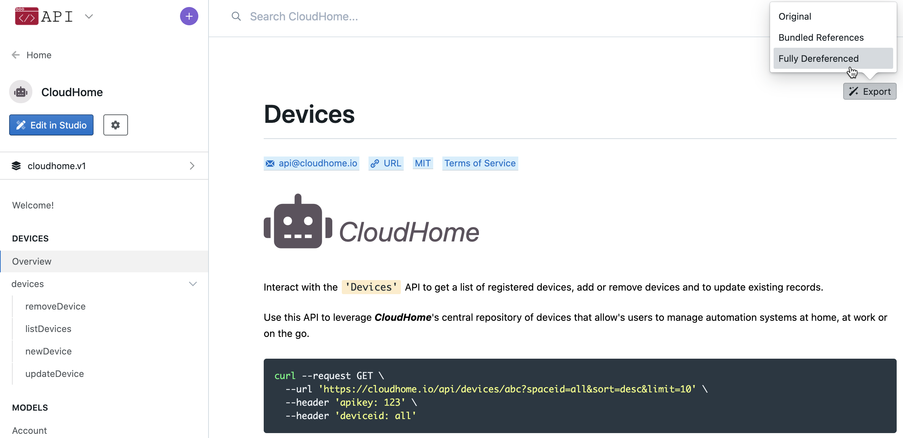
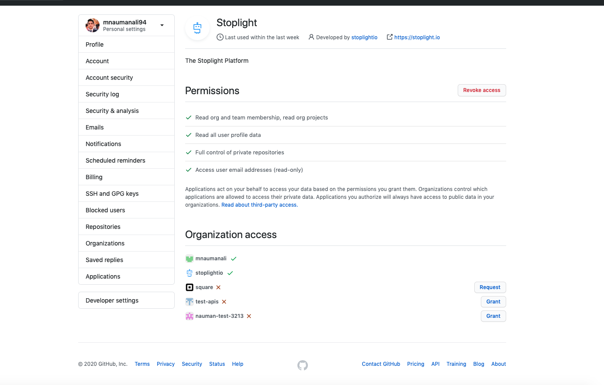

# FAQ

Below you will find answers to commonly encountered questions.

> If you are having trouble and cannot find a suitable answer, don't hesitate to [let us know](mailto:support@stoplight.io).

## Why are files missing from my project documentation?

Below are a few common reasons why APIs/models/articles may not show up in the
documentation for a Stoplight project.

### Is there a `.stoplight.json` configuration file present in your repo?

The `.stoplight.json` (or `.stoplight.yaml`) file can be used to include or
exclude paths in your repository from being exposed in the documentation. Double
check the project configuration to make sure the file you are looking for have
not been excluded (or the file is in the include path).

For more information on this feature, see [here](./2.-workspaces/c.config.md).

### Is there a `toc.json` file present in your repo?

The `toc.json` file can be used to restrict what is published in the
documentation view for a project. This is useful for controlling the
presentation of the sidebar, however it can also be a common source of
confusion.

If you have a `toc.json` file present in your project, double check the contents
to make sure the files you want to publish are listed. 

For more information on this feature, see
[here](./4.-documentation/d.table-of-contents.md).

### Is the branch you are on published in the project settings?

Verify that the branch you are pushing your updates to is published and
available. The published and available branches can be found under the project
Settings tab.

For more information on how to manage, expose, and re-label branches, see here.

### If all else fails, check the "Automation" tab

If your project is connected to a Git repository, there is an "Automation" tab
available in the project settings which should provide more information on what
events were received and if they were successfully published.

When reviewing the Automation tab, ask yourself if your recent pushes to the
repository are showing up. If not, it may point to an issue with the webhook
configuration. Try re-installing the webhook to resolve.

Errors will be highlighted in red. Pending tasks are highlighted in purple. 

> If you are seeing errors or other issues, don't hesitate to reach out to
[support@stoplight.io](mailto:support@stoplight.io) to investigate further.
## Why is there an "Others" section in the sidebar?

If you're seeing an "Others" section in the sidebar of your project documentation...

Grouping of endpoints and models is done with [tags](https://swagger.io/docs/specification/grouping-operations-with-tags/). To prevent an "Others" section from being generated, be sure to add at least one tag to each endpoint and model in your project.

You can find more information on the default order of the project sidebar (as well as how to customize it) [here](https://meta.stoplight.io/docs/platform/4.-documentation/d.table-of-contents.md).

## How do I export a file from Stoplight?

If you need to retrieve a file published in Stoplight, the quickest way to do so is using the **Export** buttons found in both Explorer and your project documentation.

***Exporting using Explorer***

***Exporting within Studio***

### What are the differences between Original, Bundled, Dereferenced.
1. Original - is the raw file keeping the $refs
2. Bundled - resolves remote $refs once, re-referencing the same objects in subsequent references (producing a smaller file)
3. Dereferenced - resolves all $refs, inserting each resolved reference inline

## Does Stoplight support adding HTML to documentation?

HTML support within Markdown is limited. See our [Markdown documentation](https://meta.stoplight.io/docs/studio/docs/Documentation/03-markdown-basics.md) for more information.

## How do I allow Stoplight to access an internal Git provider?

All network traffic from Stoplight originates from a fixed IP address. This is done so that network administrators can allow Stoplight to access your internal Git or identity providers with minimal risk to your network.

The fixed IP address is: **35.226.194.249**

## What browsers does Stoplight support?

We aim to support the following browsers and minimum versions. 

|               | Chrome | Safari        | Firefox | Edge          |
| ------------- | ------ | ------------- | ------- | ------------- |
| Documentation | 68     | 12            | 60      | 18            |
| Platform      | 68     | 12            | 60      | Not Supported |
| Studio        | 75     | Not Supported | 68      | Not Supported |

Things may work outside of these browsers and these versions, but there might be unexpected problems as we won't be testing those environments.

If something is not working in a version listed here (or newer) please [contact support](mailto:support@stoplight.io).

## Can't Edit Project in Studio

#### Not a Git project and I'm the owner

Local projects in Stoplight are stored in the browser cache. If you are on a different computer/browser, you won't be able to edit the project. 

Preferably [connect to a Git provider](2.-workspaces/configure-git/a.configuring-git.md) that Stoplight supports. Once you've done that go into studio from the browser/computer you used to first create this project, and then promote it to a Git repo.

The Git integration will allow you and your team members (Makers and above) to collaborate on this project. Keep in mind that they would need access to the Git repository as well. Git repositories are very useful once other stakeholders such as developers need access to the API designs and they support a formal review process for your design or documentation workflows via merge requests.

If you can't use a Git provider you'd be limited to using the project from the same browser you first created it from. 

**Note**: Other users in your workspace won't be able to edit a local project.

#### I'm the on the same browser/computer

This could be because you recently updated or cleaned the cache of your browser. In that case you can export the OpenAPI and schemas using the export button available in the docs. Then, import the exported files into a new project and promote it to a git project.

## Can't find GitHub Organization 

This could be due to missing permissions in GitHub. Navigate to https://github.com/settings/applications and find the Stoplight app. Click on it to go into the settings.

Notice the organization access at the bottom. Grant access to the organization you're looking to add repos from. You should then be able to add projects from your organization.
