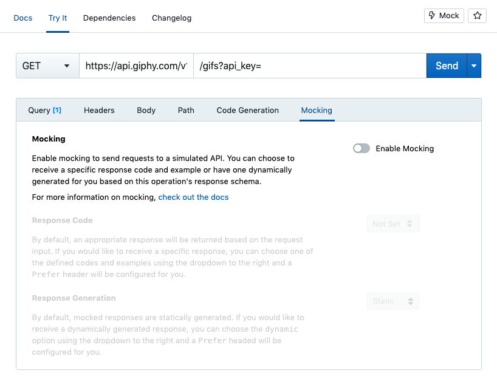
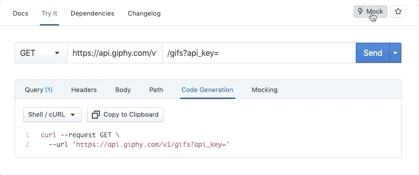
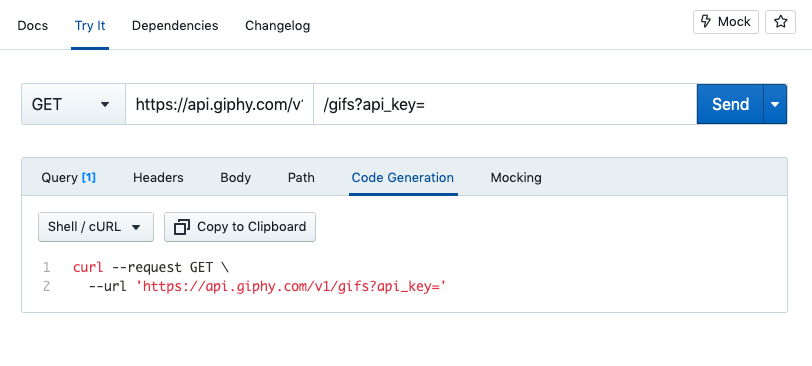

# Working with Mock Servers

Stoplight offers free, automatically updated HTTP mock servers for every API published in your workspace. These mock servers simulates real APIs, by providing endpoints and validation rules described in your API description document. 

This allows client developers to begin writing code for frontend services like web, mobile, or other backend applications, whilst the API developers are still writing their code. This can help find and solve problems early on, before the API is built, because changing all that code can be expensive (time is money).

Our hosted mock servers are powered by our [open-source mock server Prism](https://stoplight.io/open-source/prism), so if you are familiar with this tool then you'll be familiar with hosted mocking.

- Does the API contain the information the client needs?
- Is that data in the format the client needs?
- Are the resources too "normalized" and data-centric (instead of being use-case centric) that the client has to 3292375 calls to get all the data?
- Is there enough time left for feedback to be implemented?
- If the feedback spawns large enough work, will the client have time implement this API once it's done?
- Avoid all of these problems by getting a free API to play with without spending a month building it all.

Catching problems early on while you're still just tweaking the API descriptions, means you can avoid making costly changes to the production API, deprecating old things, or creating whole new global versions which add a huge workload to every single client.

## Interacting with Mock Servers

In the same way that documentation is updated on publish (or on push), mock servers are updated when pushing to the default branch. 

To talk to the HTTP mock servers, there's a few options.

1. Try it Now
2. Sample Code
3. Any HTTP Client

### Try it Now

Docs and Explorer both have a HTTP Client available in the Try it Now tab. This has hosted mocking built right in. You just need to enable mocking from the **Mocking** tab, and you're good to go.



Within "Try it Now" you can talk to any server, but if you want to talk to the mock server open up the "Mocking" tab and enable it. Now any requests will be sent to the mock server, so you can get a feel for how this API is going to respond. 

Pretend it's real, is this a good API? Should you make any changes before you get this out to your team? 

## Get the Mock Server URL

You can grab an updated mock Server URL for any endpoint from the Explorer or Docs.



### Sample Code

You don't have to use our HTTP client, you can bring any. You can use the Code Generation tab to export the request in the programming language of your choice, and if you like doing things on the command line you can copy the curl command.

All you need to is replace the URL with the Mock Server URL. 



### Any HTTP Client

If none of that seems useful, you can just grab the Mock Server URL and compose the whole URL yourself.

Consider the mock server to be a special server, just one that's not mentioned in your API description. So if you had an OpenAPI description with the following servers...

```yaml
servers:
  - description: Production
    url: "https://api.example.com"
  - description: Staging
    url: "https://api.staging.example.com"
paths:
  /hello:
    get: 
      # ...
```

You could swap out that URL for your Hosted Prism URL:

https://workspaces.TODOnothingworksyet/hello

The actual contents of the responses depends on the examples in the API Description, and if the request prefers static or dynamic mode, and if you requested specific status codes to come back. 

## More on Mocking

To read more on mocking, check out [Prism's HTTP Mocking Guide](https://stoplight.io/p/docs/gh/stoplightio/prism/docs/guides/01-mocking.md).
