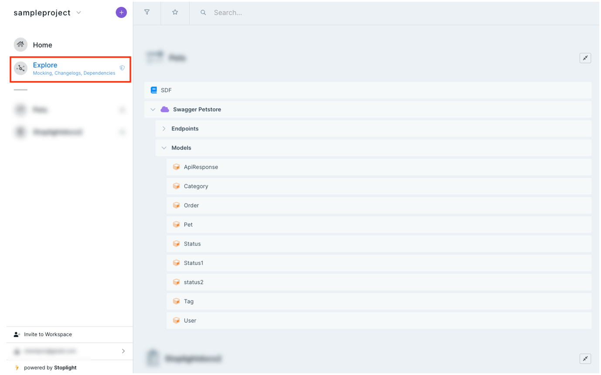

# Explorer Overview

Poor visibility into available APIs leads to inconsistencies and duplications that suffer costs to your business.

Some common problems that surface include:
* Two services solve the same problem pop-up, which lead to **multiple points of maintenance, support, and failure without any added value**.
* Two APIs from the same organization respond differently to errors, which **increases the cost of support**.
* Inconsistencies in security schemas **increase the cost of maintenance**.
* Inconsistencies in documentation and developer experience for APIs lead to **developers potentially moving to competitors**.

## Getting Started with Explorer

Explorer provides visibility by acting as a central location for all design assets across your organization. Stoplight Explorer makes it easy to find, search, and manage API artifacts.
<!-- theme: info -->

>
> Explorer is available to logged-in workspace members only.
 
After you add projects to your workspace, Explorer analyzes them and creates an indexed, searchable view of your projects.

The assets discoverable in Explorer include:
* API descriptions and endpoints
* Models/Schemas
* Markdown articles

With API artifacts in Explorer, you can: 

### Search and Filter

Search and filter by articles, APIs, endpoints, and models. Developers can avoid duplications and remove inconsistencies. Technical writers can improve documentation. API teams can write specifications, which help your business add value by using what's already available. Discoverable assets for all APIs allow consistent delivery in API design, documentation, code sample tests, and other essential operating aspects of an API.

### View Changelogs

View changelogs of each asset to track progress. Proactively inform consumers about changes that might affect them. Ensure all assets are current by viewing dependencies and changelogs together.

### Set Favorite Project Nodes

Encourage reuse for future designs by marking important project nodes to easily discover API artifacts. Technical writers can discover documentation to reuse and repurpose. Developers can reuse existing APIs in their implementations. 

### Access Hosted Mock Server URLs

Receive feedback on new API designs early in your API lifecycle by sharing projects with guests in your workspace. They can read API documentation, access the hosted mock server, and build potential solutions. 

### See Dependencies

Track and visualize inbound and outbound dependencies between your schemas and APIs. Keep track of how your changes may affect other dependent services. Avoid breaking changes and plan versions, and introduce changes that reduce clutter.

To access Explorer within your workspace, select **Explore** on the left pane.

The explorer lists all of your organization's assets. Select an asset to explore it further.

