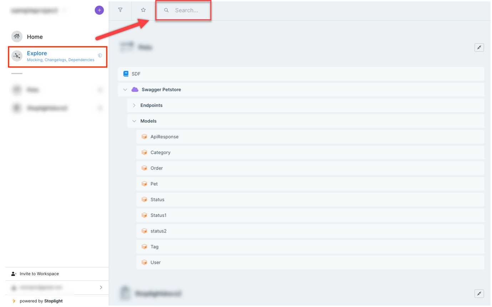
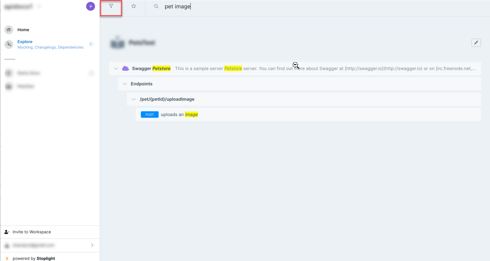

# Search and Filter Components

Search for assets from your API project and filter assets based on their type using **Explorer**.

### Use Search and Filter

Explorer provides visibility to help you navigate projects. **Search** finds specific assets or multiple assets with identical names. **Filter** provides options for browsing through similar assets. 

1. Log in to your workspace, then select **Explore** on the left pane.
2. Enter the asset name into the top pane next to the **Search** icon.

3. Select the **Filter** icon on the top pane.
4. Select an asset type from the menu.

