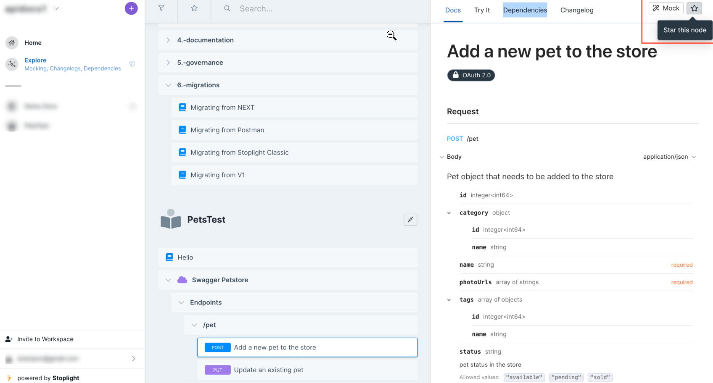
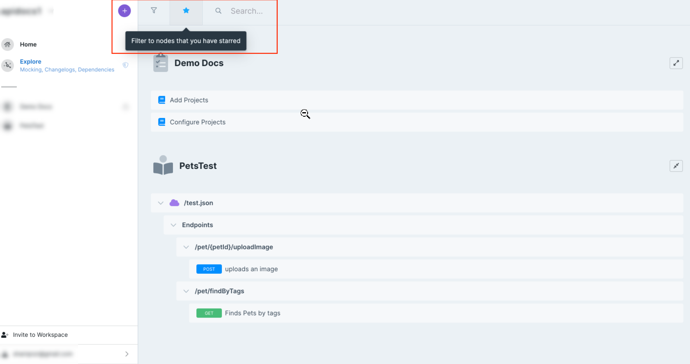

# Set Favorite Nodes

Navigate through hundreds of assets in your project by setting frequently used project nodes as favorites.

### Use Stars

Stars in Explorer operate like bookmarks. You can mark project nodes within your workspace, docs, endpoints, or models in order to easily revisit them.

Stars help with reuse by allowing your technical writers to discover documentation to repurpose. Designers can reuse schemas, and developers can reuse existing APIs in implementations.

1. Log in to your workspace, and then select **Explore** on the left pane.

2. Select an asset to open a preview.

3. Select the **Star** icon on the top left of the preview section, and the icon turns blue.

4. View your favorite project nodes by selecting the **Star** icon on the top navigation pane.

