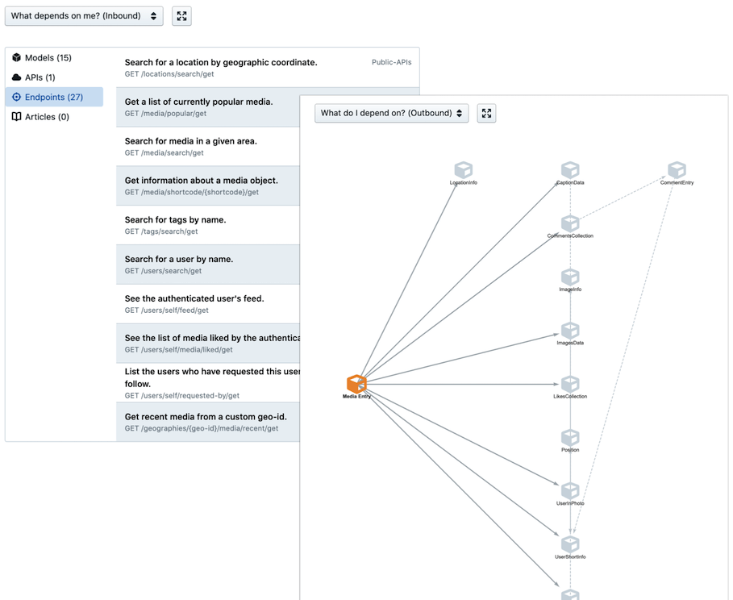
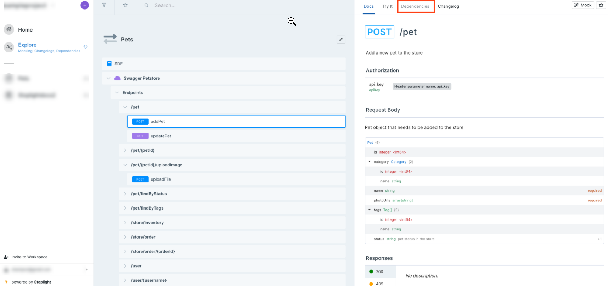

# Track Dependencies

Use Explorer to discover relationships in your data. View which APIs, endpoints, or models reference a particular model, and navigate outbound dependencies through a visual diagram.

### Dependencies

Overlapping references to models used in multiple endpoints often break changes before detection.

Dependencies act as the relationship between schemas and APIs. Track how your changes may affect other dependent services and versions without breaking changes.

<!-- theme: info -->

>
> This feature is included with the Professional Plan and higher.

### Track Dependencies

1. Log in to your workspace, and then select **Explore** on the left pane. Select an endpoint or model.

2. Select **Dependencies** on the top navigation pane to open a visual diagram.

