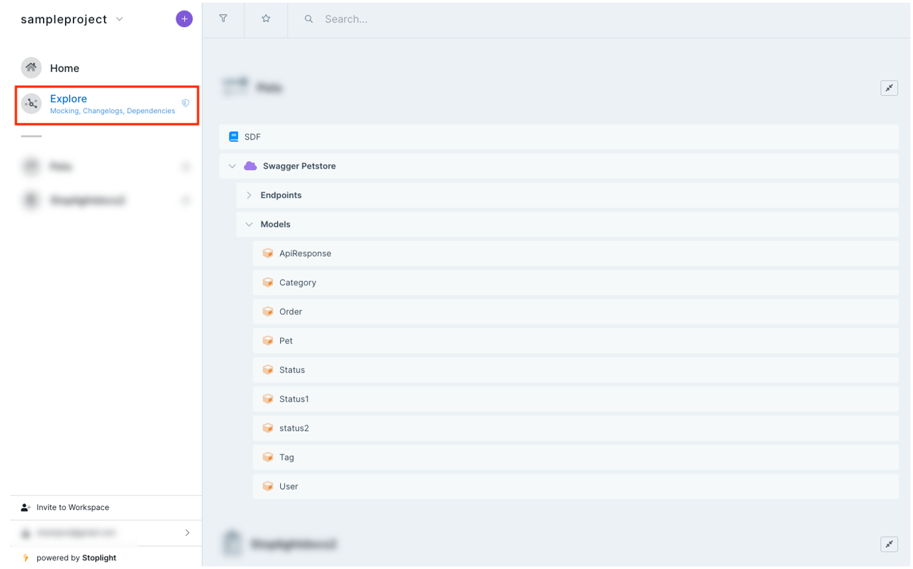

# View Changelogs

Use Explore to view a list of dated changes to any asset type in your API project.

1. Log in to your workspace, and then select **Explore** on the left pane. Select your desired asset type.

2. Select **Changelogs** on the top navigation pane to view changes to the asset.

